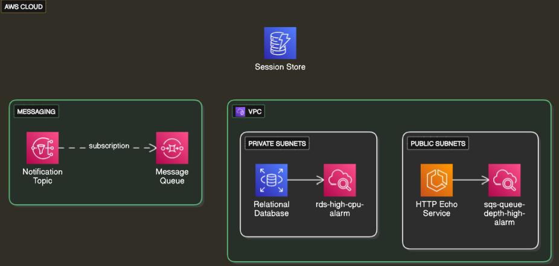

# Bonmoja Take Home Assessment
 
## 📚 Table of Contents

- [Getting Started](#getting-started)
- [Setup Instructions](#️-setup-instructions)
- [Makefile Commands](#-makefile-commands)
- [Architecture Overview](#-architecture-overview)
- [Rationale](#-rationale)
- [Known Limitations](#-known-limitations)
## Getting Started

### Project Structure
This repository is structured into components— each maintaining its own Terraform state.

To make any changes, navigate to the appropriate directory and update the configuration as needed.

### Notes

- The Makefile automatically manages the backend configuration for each environment
- Each component uses a shared `variables.tf` file that is copied during initialization
- Environment-specific variables are stored in the `vars/` directory

```
.
├── components/               # Terraform modules per service
│   ├── vpc/                  # Networking infrastructure
│   ├── ecs/                  # HTTP Echo app service
│   ├── rds/                  # PostgreSQL DB
│   ├── sns_sqs/              # Messaging layer
│   └── dynamoDB/             # NoSQL session store
├── vars/                     # tfvars files per environment (dev/qa/prod)
├── scripts/                  # Health check script
├── aws_dependencies/         # CloudFormation template for state backend (S3 & KMS)
├── Makefile                  # Automated deployment script
├── README.md                 
└── SOLUTION.md

```

## 🛠️ Setup Instructions

### Prerequisites

Ensure you have the following installed:

- [Docker](https://www.docker.com/)
- [LocalStack CLI](https://docs.localstack.cloud/get-started/)
- [Terraform](https://developer.hashicorp.com/terraform/install)
- `make` (for running Makefile)
- `awslocal` (alias for running AWS commands against LocalStack)

---

### 1. Clone the Repository

```bash
git clone https://github.com/WihanNimb/Bonmoja
```

---

### 2. Start LocalStack in Detached Mode

```bash
localstack start -d
```

Wait a few seconds for LocalStack to fully start. You can verify it's running by checking the health endpoint:

```bash
curl http://localhost:4566/_localstack/health
```

---

### 3. Deploy Base Infrastructure

This step creates the S3 bucket and KMS key used for Terraform remote state.

```bash
awslocal cloudformation create-stack \
  --stack-name state-stack \
  --template-body file://aws_dependancies/state-stack.yml
```

The system automatically polls and extracts the `KmsKeyId` ARN to inject into each module’s backend config.

---

### 4. Apply Terraform Modules

Run the following to deploy all Terraform components in order:

```bash
make apply_all env=dev
```

Modules are applied in this order:

1. VPC  
2. SNS + SQS  
3. ECS  
4. RDS  
5. DynamoDB

The backend configuration is copied to the root of the module, and the `kms_key_id` is injected at runtime using the value from CloudFormation outputs. This ensures secure state locking.

---

### 5. Run Health Check

After deployment, verify the ECS service is up:

```bash
bash scripts/health_check.sh
```

This script sends a request to:

```
http://localhost:5678/
```

and logs a warning if the service is unresponsive.

---
## 🧰 Makefile Commands

## 🧰 Makefile Commands

This project includes a `Makefile` to streamline repetitive Terraform tasks like formatting, validating, applying, and destroying modules. It abstracts away complexity by handling backend setup, KMS ARN injection, and environment-specific paths.

### Environment Configuration

The `env=dev` flag corresponds to a specific variable file located in the `vars/` directory.  
For example:

- `env=dev` uses `vars/dev.tfvars`
- `env=qa` uses `vars/qa.tfvars`
- `env=prod` uses `vars/prod.tfvars`

This allows you to reuse the same infrastructure code across multiple environments with different parameters.

### Available Commands

| Command                     | Description |
|----------------------------|-------------|
| `make apply_all env=dev`   | Deploys all Terraform modules in the correct order (VPC → SNS/SQS → ECS → RDS → DynamoDB). Waits for KMS ARN from CloudFormation and injects it into backend config. |
| `make validate_all env=dev`| Validates the Terraform configuration across all modules. |
| `make fmt_all env=dev`     | Formats Terraform code in all modules using `terraform fmt`. |
| `make destroy component=ecs env=dev` | Destroys a specific module’s infrastructure (e.g., `ecs`, `rds`, etc.) |
| `make plan component=rds env=dev` | Plans changes for a specific module. |
| `make apply component=dynamoDB env=dev` | Applies changes for a specific module. |
| `make validate component=sns_sqs env=dev` | Validates a single module’s Terraform config. |
| `make fmt-check component=vpc env=dev` | Formats a single module’s Terraform code. |

> ℹ️ The Makefile automatically waits for the `KmsKeyId` output from CloudFormation and injects it into the backend configuration before initialization. This ensures secure remote state handling per module.


## 🧭 Architecture Overview



The diagram illustrates a local AWS-like development environment using LocalStack, showcasing the core infrastructure components provisioned via Terraform:

- **VPC with Public and Private Subnets**:
  - **HTTP Echo Service** runs in the public subnets using ECS Fargate.
  - **Relational Database (RDS)** is isolated within private subnets.
  - **CloudWatch Alarms** are configured to monitor key metrics such as high CPU usage (RDS) and high queue depth (SQS).

- **Messaging System**:
  - A decoupled communication pattern is represented via an **SNS Topic** and **SQS Queue**.

- **Session Store**:
  - **DynamoDB** is set up to serve as a simple key-value store (e.g., for session data).

> ⚠️ **Note:** This diagram is illustrative and represents the components deployed during the setup. These services are not yet integrated — no application logic or data flow connects them currently.

This architectural layout serves as a foundation to demonstrate infrastructure-as-code, monitoring setup, and modular deployments within a simulated AWS environment.

## 💡 Rationale

This project demonstrates a modular, infrastructure-as-code approach using Terraform to provision a cloud-native stack in a local development environment with LocalStack.

Key design choices:

- **Modular Terraform Structure**:  
  Infrastructure is broken down into self-contained modules (VPC, ECS, RDS, DynamoDB, SNS/SQS). This promotes reusability, isolation of concerns, and easier testing and maintenance.

- **LocalStack for Local Development**:  
  Using LocalStack allows fast, cost-effective local prototyping and testing without interacting with live AWS resources. It mimics real AWS behavior closely enough for early-stage validation.

- **Makefile Automation**:  
  Common workflows like applying infrastructure and performing Terraform validation/formatting are wrapped in Makefile macros, reducing the risk of human error and improving developer efficiency.

- **CloudWatch Monitoring**:  
  The inclusion of CloudWatch alarms for RDS CPU usage and SQS queue depth reflects a production-minded approach to observability, ensuring services remain performant and issues can be detected early.

- **Decoupled Messaging**:  
  The SNS-to-SQS pattern is a common serverless communication model allowing for scalable, asynchronous processing between producers and consumers.

- **Extensibility**:  
  While the services are not currently wired together, the deployed infrastructure lays the groundwork for easily connecting application logic in future iterations (e.g., ECS consuming from SQS, writing to DynamoDB).

This rationale reflects a balance between best practices, simplicity, and clarity — suitable for demonstrating infrastructure skills without overengineering.

## ⚠️ Known Limitations

ECS Fargate CI/CD deployment via GitHub Actions is not fully testable in LocalStack due to unsupported features like ALB and service-linked roles. However, the pipeline is included and production-ready for AWS.
